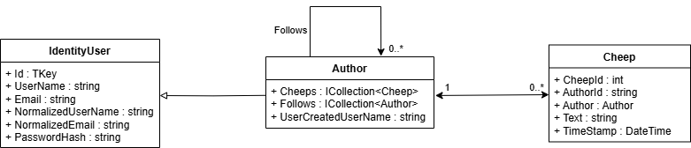
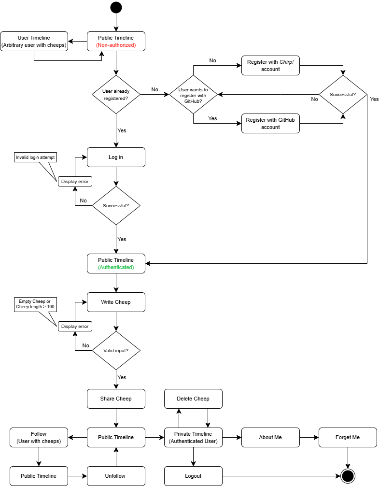

# Design and Architecture of _Chirp!_

## Domain model



## Architecture — In the small
<!Illustrate the organization of your code base. That is, illustrate which layers exist in your (onion) architecture. Make sure to illustrate which part of your code is residing in which layer.>

## Architecture of deployed application
Illustrate the architecture of your deployed application. Remember, you developed a client-server application. Illustrate the server component and to where it is deployed, illustrate a client component, and show how these communicate with each other.

.png)

## User activities



This activity diagram shows a typical user journey through the Chirp! application.  
A non-authorized user only has the options to view the public timeline, view user’s with cheeps’ timelines or login/register.  
For the sake of simplicity, the activity diagram does not show every possibility a user has at every given stage. When authorized, it is possible to navigate between public timeline, private timeline, about me and logout at all times through the navigation bar at the top of the page. It is also possible to follow users from their private timelines.  

## Sequence of functionality/calls through _Chirp!_
With a UML sequence diagram, illustrate the flow of messages and data through your Chirp! application. Start with an HTTP request that is send by an unauthorized user to the root endpoint of your application and end with the completely rendered web-page that is returned to the user.

Make sure that your illustration is complete. That is, likely for many of you there will be different kinds of "calls" and responses. Some HTTP calls and responses, some calls and responses in C# and likely some more. (Note the previous sentence is vague on purpose. I want that you create a complete illustration.)

.png)

# Process

## Build, test, release, and deployment
<!Illustrate with a UML activity diagram how your Chirp! applications are build, tested, released, and deployed. That is, illustrate the flow of activities in your respective GitHub Actions workflows.

[UML activity diagram here]

When an issue is resolved, a pull request is created. This triggers the "build and test" workflow, which tries to build the application and, if built successfully, test it. Both occur in an isolated environment.

If the build or test fails, the application code and the workflow are reviewed, refactored and pushed to the branch, restarting the build and test process.

On passing tests, the team considered whether solving this issue justifies a release. If not, another issue is addressed, otherwise the process continues.

A tag is manually created on the latest commit of the main branch. When pushed, it triggers the "release" workflow. This workflow attempts to create a release for Windows, Mac and Linux respectively.

On success, the Linux release is automatically deployed to Azure. If the deployment fails, the workflow and Azure setting are reviewed and fixed.

After a successful deployment, the process ends.


Describe the illustration briefly, i.e., how your application is built, tested, released, and deployed.>

## Team Work
<!Show a screenshot of your project board right before hand-in. Briefly describe which tasks are still unresolved, i.e., which features are missing from your applications or which functionality is incomplete.

Briefly describe and illustrate the flow of activities that happen from the new creation of an issue (task description), over development, etc. until a feature is finally merged into the main branch of your repository.>

**PICTURE OF KANBAN BOARD AT HAND-IN**


The above diagram shows our flow of activities, all the way from creating issues until merging into main.  
For each issue, the assigned person(s) would create a new branch, frequently committing during development. When the acceptance criteria and definition of done were met, a pull request would be created.  
Merging into main was blocked until approved. As such, the branch would be merged into main upon approval from one or more peers.  

We have also used GitHub Actions to auto-move issues in two cases:
 - From ‘Todo’ to ‘In Progress’ when an issue is assigned to a user.
 - From ‘In Progress’ to ‘Done’ when an issue is closed.

Furthermore, our GitHub Actions workflows run all of the application's tests on every commit as well as pull requests.  

## How to make _Chirp!_ work locally
<!There has to be some documentation on how to come from cloning your project to a running system. That is, Adrian or Helge have to know precisely what to do in which order. Likely, it is best to describe how we clone your project, which commands we have to execute, and what we are supposed to see then.>

### Here's a guide on how to make _Chirp!_ work locally:

**Step 1:**

Clone the project into a desired folder via the terminal:

  ``` sh
  git clone https://github.com/ITU-BDSA2024-GROUP18/Chirp.git
  ```

**Step 2:**

Switch to Chirp directory

  ``` sh
  cd Chirp
  ```

**Step 3:**

In order to run the application with Github oAuth working, Github secrets are required. They are added as such:

  ```sh
  dotnet user-secrets set "authentication:github:clientId:local" "<Local Github client Id>"
  dotnet user-secrets set "authentication:github:clientSecret:local" "<Local Github client Secret>"
  ```

**Step 4:**

Switch to the Chirp.Web folder:

  ``` sh
  cd src/Chirp.Web
  ```

**Step 5:**

The application can now be run via the command:

  ``` sh
  dotnet run
  ```

The command will build the application and can be accessed via https://localhost:5001/ (While the application is running locally)

## How to run test suite locally
<!List all necessary steps that Adrian or Helge have to perform to execute your test suites. Here, you can assume that we already cloned your repository in the step above.

Briefly describe what kinds of tests you have in your test suites and what they are testing.

Maybe include image of test coverage here>

### Here's a guide on how to run the test suite for _Chirp!_:
The unit and integration tests are in the RazorApp.Tests folder while the UI tests are in the PlaywrightTests folder. 

#### Unit & integration tests

**Step 1:**

Switch to the RazorApp.Tests folder (From the root of the project):
  ``` sh
  cd test/RazorApp.Tests
  ```

**Step 2:**

Simply run the following command to run the tests
  ``` sh
  dotnet test
  ```
The test will now be run and they will show that all 27 tests are passing

These tests are testing the database, repository, and API layers. They check that data operations (adding, querying, and retrieving authors and cheeps) are accurate, business logic behaves correctly, and API endpoints return the expected responses. Edge cases, such as missing data or empty results, are also tested to ensure robustness.

#### UI tests

**Step 1:**

In order to run the Playwright UI tests, first run the following command to install the required browsers for Playwright:

  ``` sh
  pwsh test/PlaywrightTests/bin/Debug/net8.0/playwright.ps1 install
  ```

**Step 2:**

Now switch to the following directory (From root of project):

  ``` sh
  cd test/PlaywrightTests
  ```

**Step 3:**

You can now run the tests (Very important that no instance of Chirp is running locally):

  ``` sh
  dotnet test
  ```
The result of the command should be 11 passed tests. These tests test workflows like user registration, login, cheep creation, and deletion, ensuring the UI updates appropriately and data reflects accurately. The tests also test for edge cases, such as input limits, pagination, follow/unfollow functionality, and XSS prevention.

# Ethics

## License
<!State which software license you chose for your application.>

We decided to go with the MIT License because it's simple and developer friendly. It gives others the freedom to use, modify, and share our code. At the same time, it requires people to give credit to us as the original creators. The license also keeps things straightforward by not holding us responsible for how others use the app. More importantly the license also has low amount of constrictions on our code. 

## LLMs, ChatGPT, CoPilot, and others
State which LLM(s) were used during development of your project. In case you were not using any, just state so. In case you were using an LLM to support your development, briefly describe when and how it was applied. Reflect in writing to which degree the responses of the LLM were helpful. Discuss briefly if application of LLMs sped up your development or if the contrary was the case.


We have primarily used ChatGPT as a tool for knowledge exchange and to assist in debugging code. When a concept has been challenging to understand, the tool has been utilized as a consultant to help clarify and deepen our understanding. In certain cases, the tool has contributed directly to the generation of code that was integrated into the codebase. When this has occurred, ChatGPT has been acknowledged as a co-author either within the source code itself or in the associated commit messages, or both

—Co-Authored-by: ChatGPT (remember to delete this bad joke)

