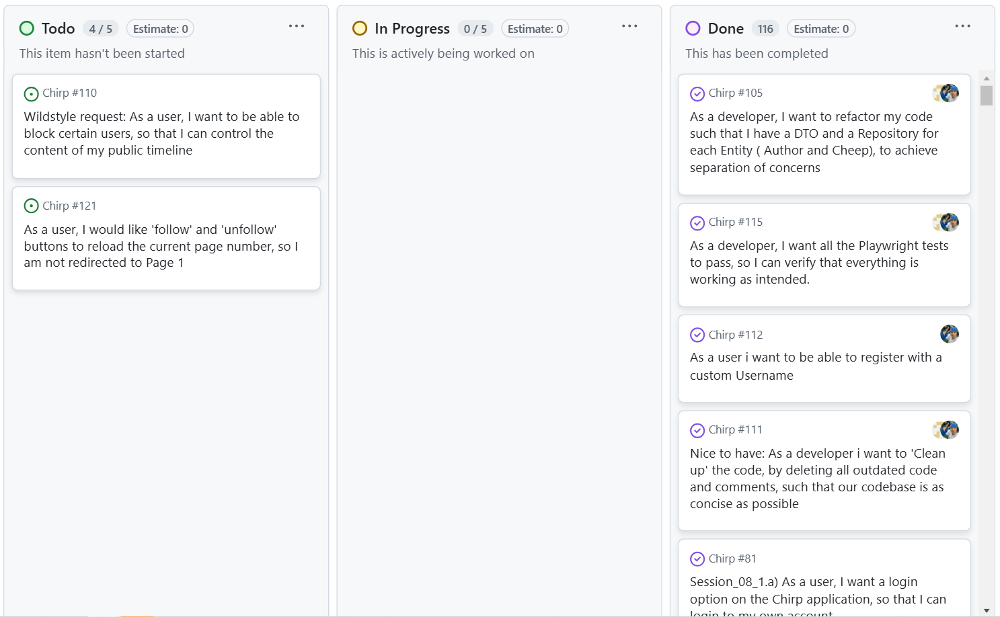

\newpage

# Design and Architecture of _Chirp!_

## Domain model


## Architecture — In the small

Below is our Onion Architecture diagram where Chirp.Core contains entities and DTOs, while repositories interact with these core entities to abstract data access. The Services layer provides business logic and interacts with repositories, and the outermost Chirp.Web layer handles the user interface through page models and Razor pages. At the bottom, Chirp.Infrastructure supports repositories and services. Arrows indicate dependency flow, emphasizing clean separation of concerns.

{ width=75% }

## Architecture of deployed application

The diagram illustrates the architecture of our deployed application.


The Chirp web application is hosted on Azure Web App Service. Although only the Chirp.Web server is deployed to Azure, the internal structure is included to highlight key dependencies. Clients communicate with the Chirp web server via HTTPS. The web server communicates with the GitHub web server for OAuth authorization.

## User activities


This activity diagram shows a typical user journey through the Chirp! application.  
A non-authorized user only has the option to view the public timeline, view users with cheeps’ timelines, or login/register.  
For the sake of simplicity, the activity diagram does not show every possibility a user has at every given stage. When authorized, it is possible to navigate between public timeline, private timeline, about me and logout at all times through the navigation bar at the top of the page. It is also possible to follow users from their private timelines.  

## Sequence of functionality/calls through _Chirp!_

Below is a sequence diagram illustrating the flow of messages and data through the Chirp! application, when an unauthorized user sends a HTTPS request to the root endpoint of our application.

.png)

When an instance of CheepRepository invokes method ReadPublicTimeline() it will query the database. Our application uses LINQ and Entity Framework Core, which translates the query into SQL and maps the result of the query to Cheep objects.

## Wildstyle Features and Design Choices

We added the option to delete cheeps as a wildstyle feature, as seen below.


We also added pagination to the UI, so users can navigate between pages without having to alter the URL.


In regards to design choices, we have chosen to make users log in with their username instead of their e-mail.  
Both usernames and e-mails are case-insensitive and must be unique.

Furthermore, we have chosen to remove the e-mail confirmation step, as it was not user friendly and did not actually confirm the e-mail.

The users ‘Helge’ and ‘Adrian’ are created in the DbInitializer script with the e-mails ‘ropf@itu.dk’ and ‘adho@itu.dk’. As such, they do not have passwords, and can therefore not log in to the application.  
Since both usernames and e-mails are unique, you will not be able to register a new user with any of these usernames/e-mails.

# Process

## Build, test, release, and deployment

{ width=25% } { width=25% }

The "build and test" workflow tries to build the application and, if built successfully, tests it. Both occur in an isolated environment.  
The workflow is triggered on every push and pull request for all branches.

The "release" workflow attempts to create a release for Linux, Windows, and MacOS respectively.  
It is triggered when a tag of format 'v.\*.\*' is pushed.  
If successful, the Linux release is deployed to Azure.  

## Team Work



We had two open issues at the time of hand-in, none of which were direct requirements.


The above diagram shows our flow of activities, all the way from creating issues until merging into main.  
For each issue, the assigned person(s) would create a new branch, frequently committing during development. When the acceptance criteria and definition of done were met, a pull request would be created.  
Merging into main was blocked until approved. As such, the branch would be merged into main upon approval from one or more peers.  

We have also used GitHub Actions to auto-move issues in two cases:

 - From ‘Todo’ to ‘In Progress’ when an issue is assigned to a user.
 - From ‘In Progress’ to ‘Done’ when an issue is closed.

Furthermore, our GitHub Actions workflows run all of the application's tests on every commit as well as pull requests.  

## How to make _Chirp!_ work locally

### Here's a guide on how to make _Chirp!_ work locally:
_Note: This project uses .Net 8_

**Step 1:**

Clone the project into a desired folder via the terminal:

  ``` sh
  git clone https://github.com/ITU-BDSA2024-GROUP18/Chirp.git
  ```

**Step 2:**

Switch to Chirp directory:

  ``` sh
  cd Chirp
  ```

**Step 3:**

In order to run the application with GitHub OAuth working, GitHub secrets are required. They are added as such:

  ```sh
  dotnet user-secrets set "authentication:github:clientId:local" "<Local Github client Id>"
  dotnet user-secrets set "authentication:github:clientSecret:local" "<Local Github client Secret>"
  ```

**Step 4:**

Switch to the Chirp.Web folder:

  ``` sh
  cd src/Chirp.Web
  ```

**Step 5:**

The application can now be run via the command:

  ``` sh
  dotnet run
  ```

The command will build the application and can be accessed via https://localhost:5001/ (While the application is running locally)

_Note:_ When opening the link you might encounter an error telling you that the website is unsafe and not trusted. To solve this, you need a localhost certificate. This can be achieved by the following command:

  ``` sh
  dotnet dev-certs https --trust
  ```

## How to run test suite locally
_Note: This project uses .Net 8_

### Here's a guide on how to run the test suite for _Chirp!_:
Our project has unit and integration tests in the RazorApp.Tests folder, while it has UI tests in the PlaywrightTests folder. 

#### Unit & integration tests

**Step 1:**

Switch to the RazorApp.Tests folder (From the root of the project):

  ```sh
  cd test/RazorApp.Tests
  ```

**Step 2:**

Simply run the following command to run the tests

  ``` sh
  dotnet test
  ```
The test will now be run and they will show that all 27 tests are passing.

These tests are testing the database, repository, and API layers. They check that data operations (adding, querying, and retrieving authors and cheeps) are accurate, business logic behaves correctly, and API endpoints return the expected responses. Edge cases, such as missing data or empty results, are also tested to ensure robustness.

We have also used a Code Coverage tool called Coverlet to see how much of our codebase is being tested, as well as ReportGenerator to turn the output of Coverlet into a HTML file to view.


#### UI tests

**Step 1:**

In order to run the Playwright UI tests, first run the following command to install the required browsers for Playwright:

  ``` sh
  pwsh test/PlaywrightTests/bin/Debug/net8.0/playwright.ps1 install
  ```

**Step 2:**

Now switch to the following directory (From root of project):

  ``` sh
  cd test/PlaywrightTests
  ```

**Step 3:**

You can now run the tests (Very important that no instance of Chirp is running locally):

  ``` sh
  dotnet test
  ```
The result of the command should be 11 passed tests. These tests test workflows like user registration, login, cheep creation, and deletion, ensuring the UI updates appropriately and data reflects accurately. The tests also test for edge cases, such as input limits, pagination, follow/unfollow functionality, and XSS prevention.

# Ethics

## License

We decided to go with the MIT License because it is simple and developer friendly. It gives others the freedom to use, modify, and share our code. At the same time, it requires people to give credit to us as the original creators. The license also keeps things straightforward by not holding us responsible for how others use the app. More importantly, the license also has a low amount of constrictions on our code. 

## LLMs, ChatGPT, CoPilot, and others

We have primarily used ChatGPT as a tool for knowledge gathering and to assist in debugging code. When a concept has been challenging to understand, the tool has been utilized as a consultant to help clarify and deepen our understanding. In certain cases, the tool has contributed directly to the generation of code that was integrated into the codebase. When this has occurred, ChatGPT has been acknowledged as a co-author either within the source code itself or in the associated commit messages, or both.

The answers we received were mostly helpful and accelerated our process. ChatGPT was helpful in understanding new topics and technologies. While it made occasional mistakes in debugging and code generation, these were usually easy to spot and correct.

Co-authored-by: ChatGPT (remember to delete this bad joke)
