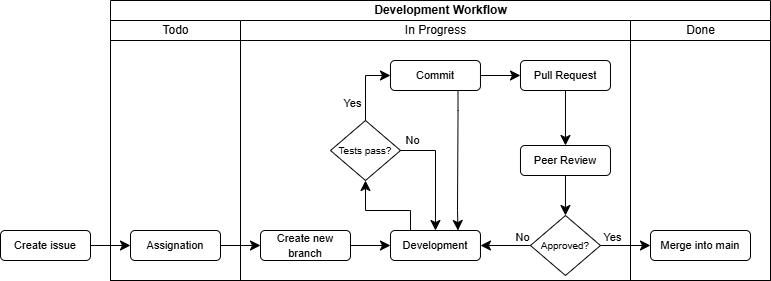

# Design and Architecture of _Chirp!_

## Domain model


## Architecture — In the small
<!Illustrate the organization of your code base. That is, illustrate which layers exist in your (onion) architecture. Make sure to illustrate which part of your code is residing in which layer.>

## Architecture of deployed application
Illustrate the architecture of your deployed application. Remember, you developed a client-server application. Illustrate the server component and to where it is deployed, illustrate a client component, and show how these communicate with each other.


## User activities


This activity diagram shows a typical user journey through the Chirp! application.  
A non-authorized user only has the options to view the public timeline, view user’s with cheeps’ timelines or login/register.  
For the sake of simplicity, the activity diagram does not show every possibility a user has at every given stage. When authorized, it is possible to navigate between public timeline, private timeline, about me and logout at all times through the navigation bar at the top of the page. It is also possible to follow users from their private timelines.  

## Sequence of functionality/calls through _Chirp!_
With a UML sequence diagram, illustrate the flow of messages and data through your Chirp! application. Start with an HTTP request that is send by an unauthorized user to the root endpoint of your application and end with the completely rendered web-page that is returned to the user.

Make sure that your illustration is complete. That is, likely for many of you there will be different kinds of "calls" and responses. Some HTTP calls and responses, some calls and responses in C# and likely some more. (Note the previous sentence is vague on purpose. I want that you create a complete illustration.)

.png)

# Process

## Build, test, release, and deployment
<!Illustrate with a UML activity diagram how your Chirp! applications are build, tested, released, and deployed. That is, illustrate the flow of activities in your respective GitHub Actions workflows.

Describe the illustration briefly, i.e., how your application is built, tested, released, and deployed.>

## Team Work
<!Show a screenshot of your project board right before hand-in. Briefly describe which tasks are still unresolved, i.e., which features are missing from your applications or which functionality is incomplete.

Briefly describe and illustrate the flow of activities that happen from the new creation of an issue (task description), over development, etc. until a feature is finally merged into the main branch of your repository.>

**PICTURE OF KANBAN BOARD AT HAND-IN**



The above diagram shows our flow of activities, all the way from creating issues until merging into main.  
For each issue, the assigned person(s) would create a new branch, frequently committing during development. When the acceptance criteria and definition of done were met, a pull request would be created.  
Merging into main was blocked until approved. As such, the branch would be merged into main upon approval from one or more peers.  

We have also used GitHub Actions to auto-move issues in two cases:
 - From ‘Todo’ to ‘In Progress’ when an issue is assigned to a user.
 - From ‘In Progress’ to ‘Done’ when an issue is closed.

Furthermore, our GitHub Actions workflows run all of the application's tests on every commit as well as pull requests.  

## How to make _Chirp!_ work locally
<!There has to be some documentation on how to come from cloning your project to a running system. That is, Adrian or Helge have to know precisely what to do in which order. Likely, it is best to describe how we clone your project, which commands we have to execute, and what we are supposed to see then.>

Here's a guide on how to make _Chirp!_ work locally:

Step 1:

Clone the project into a desired folder via the terminal:
  ```
  git clone https://github.com/ITU-BDSA2024-GROUP18/Chirp.git
  ```

Step 2:


## How to run test suite locally
<!List all necessary steps that Adrian or Helge have to perform to execute your test suites. Here, you can assume that we already cloned your repository in the step above.

Briefly describe what kinds of tests you have in your test suites and what they are testing.>

**IMAGE OF TEST COVERAGE!**


Here's a guide on how to run the test suite for _Chirp!_:

If you haven't already cloned the project look at step 1 in the section above

Step 1:


We have unit tests that test individual methods. These tests cover nearly all lines of code in Chirp.Core and Chirp.Infrastructure.  
The unit tests assure that our service and repository methods work as intended.

**IMAGE OF TEST COVERAGE!**

Additionally, we have a number of PlayWright tests for End-to-End testing.  
These tests ...  

# Ethics

## License
<!State which software license you chose for your application.>

We decided to go with the MIT License because it's simple and developer friendly. It gives others the freedom to use, modify, and share our code. At the same time, it requires people to give credit to us as the original creators. The license also keeps things straightforward by not holding us responsible for how others use the app. More importantly the license also has low amount of constrictions on our code. 

## LLMs, ChatGPT, CoPilot, and others
<!State which LLM(s) were used during development of your project. In case you were not using any, just state so. In case you were using an LLM to support your development, briefly describe when and how it was applied. Reflect in writing to which degree the responses of the LLM were helpful. Discuss briefly if application of LLMs sped up your development or if the contrary was the case.>
